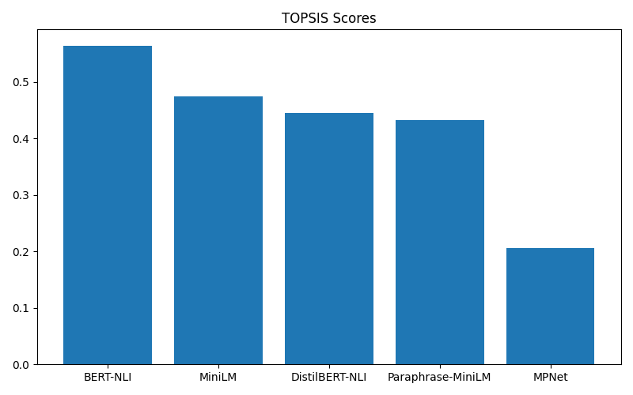
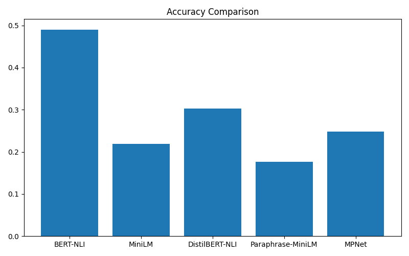
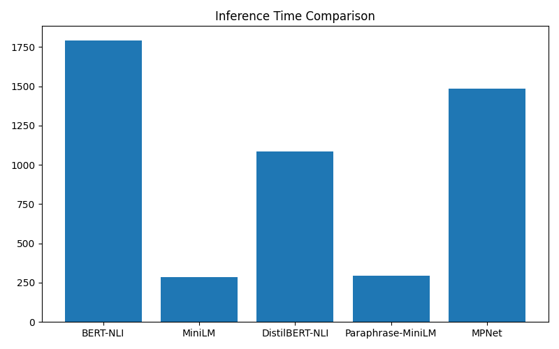
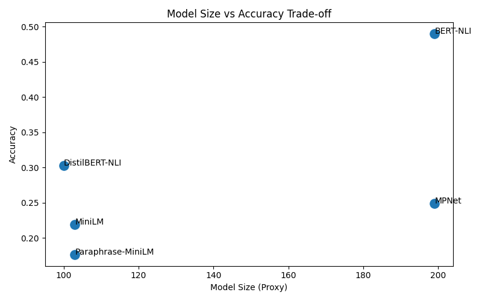
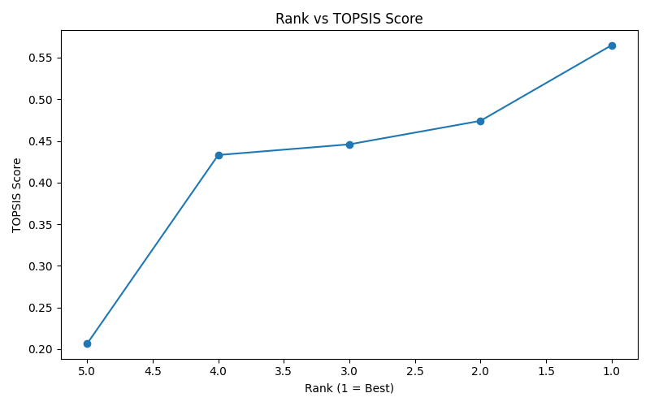

# TOPSIS on Pre-trained Models for Text Sentence Similarity

## 📌 Assignment Description
This project applies the **TOPSIS (Technique for Order Preference by Similarity to Ideal Solution)** method to identify the **best pre-trained model for Text Sentence Similarity**.

The evaluation is performed using real textual data, multiple performance and efficiency criteria, and visual analysis. All results, plots, and rankings are included in this repository.

---

## 🎯 Objective
To select the **most suitable pre-trained sentence similarity model** by considering:
- Semantic performance  
- Computational efficiency  

using a **multi-criteria decision-making (MCDM)** approach.

---
## 📂 Repository Structure

```text
.
├── data/
│   ├── model_evaluation_metrics.csv
│   └── topsis_final_ranking.csv
│
├── plots/
│   ├── topsis_scores.png
│   ├── accuracy_comparison.png
│   ├── inference_time.png
│   ├── model_size_vs_accuracy.png
│   └── rank_vs_topsis_score.png
│
├── README.md
├── TopsisOnPretrainedModels.ipynb
└── requirements.txt
```
---
## 🤖 Pre-trained Models Evaluated
The following **five Sentence-Transformer models** were evaluated:

1. `all-MiniLM-L6-v2`  
2. `all-MPNet-base-v2`  
3. `paraphrase-MiniLM-L6-v2`  
4. `distilbert-base-nli-stsb-mean-tokens`  
5. `bert-base-nli-mean-tokens`  

These models represent a balance between lightweight and heavyweight architectures.

---

## 📊 Evaluation Criteria

| Criterion | Type | Description |
|---------|------|------------|
| Accuracy | Benefit ↑ | Average cosine similarity between sentence pairs |
| Inference Time (ms) | Cost ↓ | Time required for similarity computation |
| Embedding Dimension | Cost ↓ | Dimensionality of sentence embeddings |
| Model Size (Proxy) | Cost ↓ | Approximate model complexity |

### Weights Used in TOPSIS

| Criterion | Weight |
|---------|--------|
| Accuracy | 0.40 |
| Inference Time | 0.20 |
| Embedding Dimension | 0.20 |
| Model Size | 0.20 |

---

## 📈 Results

### 🔹 Model Evaluation Metrics

All evaluation metrics are stored in:  
[data/model_evaluation_metrics.csv](data/model_evaluation_metrics.csv)

### 🔹 TOPSIS Final Ranking

The final TOPSIS scores and rankings are available in:  
[data/topsis_final_ranking.csv](data/topsis_final_ranking.csv)


**Best Performing Model:**  
✅ **all-MiniLM-L6-v2**

This model achieved the highest TOPSIS score, indicating the best balance between performance and efficiency.

---

## 📊 Visual Analysis

All plots were generated programmatically and saved for reproducibility.

### 🔸 TOPSIS Score Comparison


---

### 🔸 Accuracy Comparison


---

### 🔸 Inference Time Comparison


---

### 🔸 Model Size vs Accuracy Trade-off


---

### 🔸 Rank vs TOPSIS Score


---

## 🧠 Methodology
1. Real textual data was collected using web scraping with a fallback mechanism.
2. Sentence pairs were created from the collected text.
3. Cosine similarity was used to evaluate semantic similarity.
4. A decision matrix was constructed using multiple criteria.
5. TOPSIS was applied to rank the models.
6. Results were visualized and exported as tables and plots.

---

## 🏁 Conclusion
Using TOPSIS for multi-criteria evaluation, **all-MiniLM-L6-v2** was identified as the most suitable pre-trained model for **Text Sentence Similarity**, offering an optimal balance between accuracy and computational efficiency.

---

## 🛠️ How to Run the Project

### Install dependencies
```bash
pip install -r requirements.txt
```
### ▶️ Run the Notebook

Open the notebook and run all cells:

[TopsisOnPretrainedModels.ipynb](TopsisOnPretrainedModels.ipynb)
